# Sistema de Gestão de Frota e Entregas

## Descrição do Projeto

Este projeto é um sistema de gerenciamento para uma transportadora, permitindo o controle de caminhões e motoristas, bem como o rastreamento de entregas e cargas. O sistema permitirá ao cliente acompanhar os detalhes da frota, como quantidade de caminhões, horários das entregas, tipos de cargas, e os valores totais das entregas por dia.

## Tecnologias Utilizadas

- **Java**: Linguagem de programação.
- **Spring Boot**: Framework para desenvolvimento de aplicações Spring com mais rapidez e facilidade.
- **PostgreSQL**: Sistema de gerenciamento de banco de dados.
- **Spring Data JPA**: Para persistência de dados de forma simplificada e abstrata.
- **Spring Security**: Para autenticação e segurança da aplicação.
- **Spring Web**: Para construção de APIs REST.
- **Lombok**: Para redução de código boilerplate.
- **Spring Boot DevTools**: Para desenvolvimento eficiente com reinicialização automática.
- **Thymeleaf**: Motor de template para aplicações web.
- **Validation**: Para validação de dados de entrada.

## Escopo do Projeto

O sistema permitirá:
- Cadastro e gerenciamento de caminhões e motoristas.
- Rastreamento e registro de entregas, incluindo detalhes sobre cargas, valores e destinos.
- Cálculo automático de valores adicionais baseados em regras específicas de destino das entregas.
- Indicação de entregas valiosas, perigosas e com seguro, conforme tipo de carga e valor.

## Diagrama de Classes

```mermaid
classDiagram
    direction LR
    note for Cliente  "Cliente controla sua frota de caminhões."
    class Cliente {
            +Long id
            +String nome
            +List<Caminhao> frota
        }
    
    note for Caminhao  "Um caminhão está associado a um motorista e até 4 entregas por mês."
    class Caminhao {
        +Long id
        +String placa
        +int capacidade
        +Cliente cliente
        +Motorista motorista
        +List<Entrega> entregas
    }    

    note for Motorista "Um motorista só pode fazer duas entregas por mês."
    note for Motorista "Um motorista só pode fazer uma entregas para o nordeste."
    class Motorista {
        +Long id
        +String nome
        +Caminhao caminhao
        +List<Entrega> entregas
    }
    
    note for Entrega  "Detalhes da Entrega: valores > 30mil (Valiosa), eletrônicos (Segurada), combustível (Perigosa)."
    class Entrega {
        +Long id
        +String destino
        +double valorBase
        +LocalDate dataEntrega
        +double valorTotal
        +Boolean valiosa
        +Boolean segurada
        +Boolean perigosa
        +Caminhao caminhao
        +Motorista motorista
        +Carga carga
    }

    note for Carga "Carga está associada a uma entrega específica."
    class Carga {
        +Long id
        +String tipo
        +String descricao
        +Entrega entrega
    }
    

    Cliente "1" -- "*" Caminhao : "Possui"
    Caminhao "1" -- "1" Cliente : "Pertence a"
    Caminhao "1" -- "0..1" Motorista : "Operado por"
    Caminhao "1" -- "*" Entrega : "Realiza"
    Motorista "1" -- "0..2" Entrega : "Realiza"
    Entrega "1" -- "1" Carga : "Contém"
    
```



## Iniciando a aplicação
tenha o docker instalado

```
Rode o comando para iniciar a aplicação 

docker-compose up --build

```
